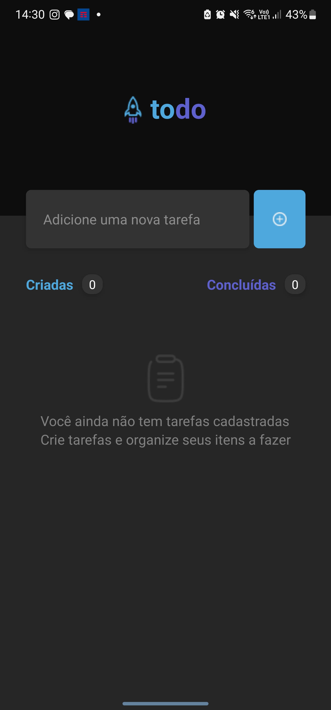
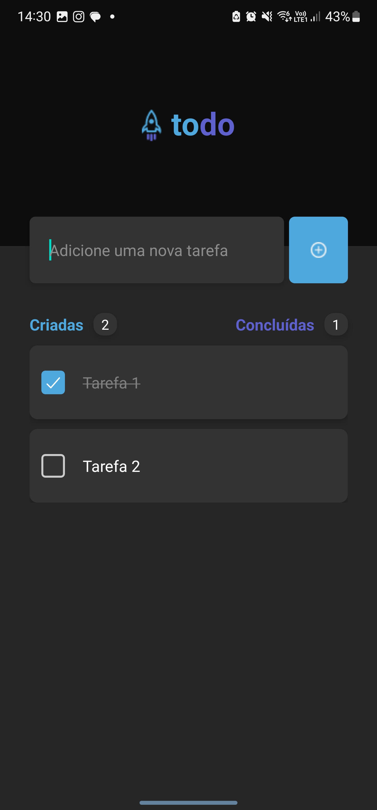

# To-Do App

Um aplicativo de gerenciamento de tarefas simples, desenvolvido com React Native e Expo. Este projeto permite que os usuários adicionem, visualizem e marquem tarefas como concluídas.

## Tecnologias Utilizadas

- **React**: Uma biblioteca JavaScript para construir interfaces de usuário.
- **React Native**: Uma biblioteca para criar aplicativos móveis nativos usando React.
- **Expo**: Um conjunto de ferramentas e serviços para desenvolver aplicações React Native rapidamente.
- **@react-native-community/checkbox**: Um componente de checkbox para React Native.
- **react-native-svg**: Um componente que permite trabalhar com SVGs no React Native.
- **react-native-vector-icons**: Uma biblioteca de ícones que fornece acesso a uma ampla gama de ícones em React Native.

## Instalação

Para rodar este projeto localmente, siga os passos abaixo:

1. Clone o repositório:
   ```bash
   git clone https://github.com/seu-usuario/to-do-app.git
   cd to-do-app

2. Instale as dependências:
    ```bash
    npm install

## Executar o projeto
1. Execute:
    ```bash
    npm start

## Telas do projeto


